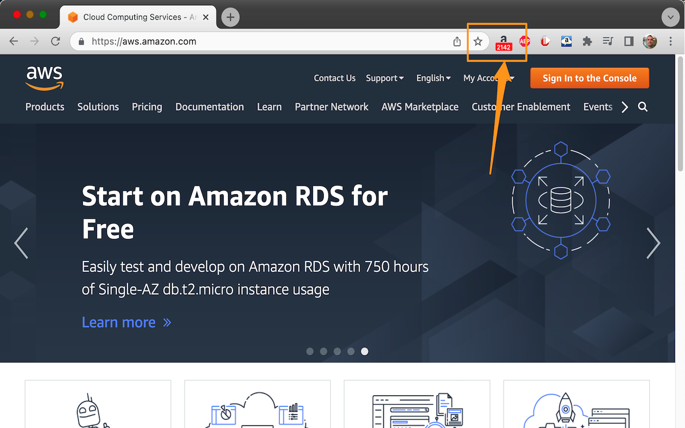

# AMZN stock ticker Chrome extension

This Chrome extension simply adds an AMZN stock quote to your extension bar. Nothing more nothing less.


## Configuration

This extension needs an API Key to the Yahoo Finance API via rapidapi.com. Here's how you can sign up for a free API key:

1. Go to https://rapidapi.com/
2. Click ["Sign-Up"](https://rapidapi.com/auth/sign-up]) in the top right corner and create a free account
3. Locate the [Finance / YH Finance API](https://rapidapi.com/apidojo/api/yh-finance/)
4. Navigate to the "market/v2/get-quotes" API
5. Click "Subscribe to test" and pick the $0.00 free plan which gives you 500 requests per month (or about 16 requests per day)
6. From the right most test pane, copy the value for ```X-RapidAPI-Key```. It is a 50-character string.


Now configure the extension to use your new API key.

1. "Pin" the extension from the extension menu so it's always visible
1. Right click on the extension's icon and click "Options". 
2. Paste the API key in the "RAPID API Key" field.
3. Set interval to your desire but make sure you stay under 500 requests per month (or about 16 per day)
4. We even support other stock symbols but why would you care about those!
4. Click "Save"

Enjoy!


## Screenshot example


